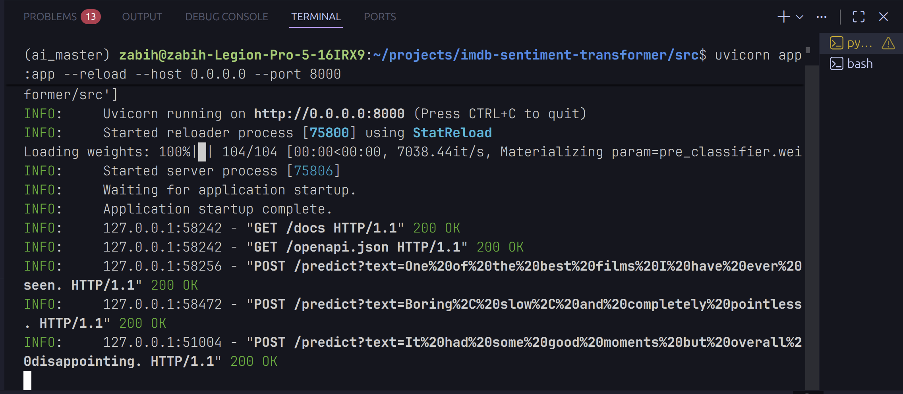
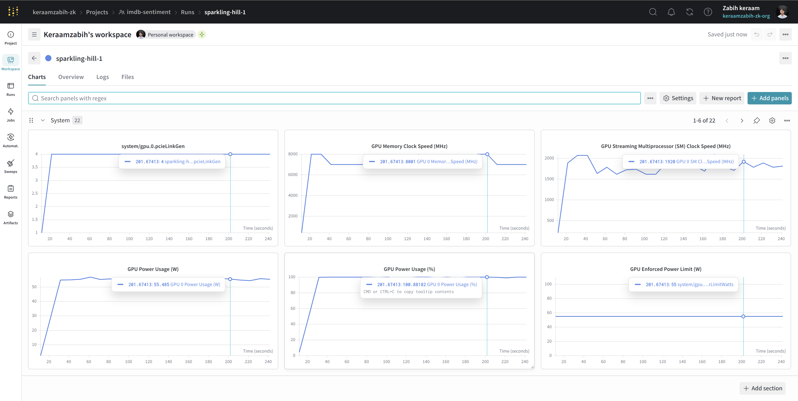
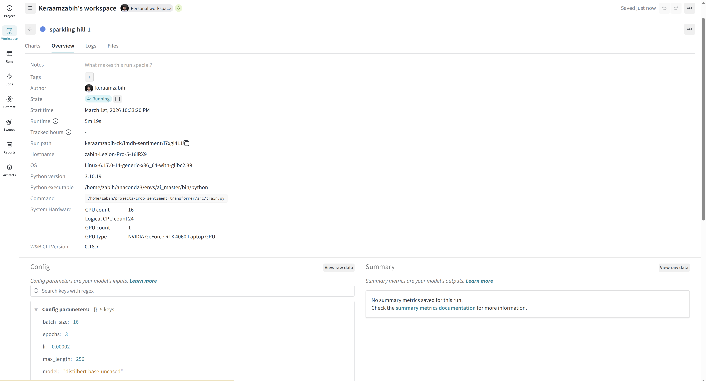
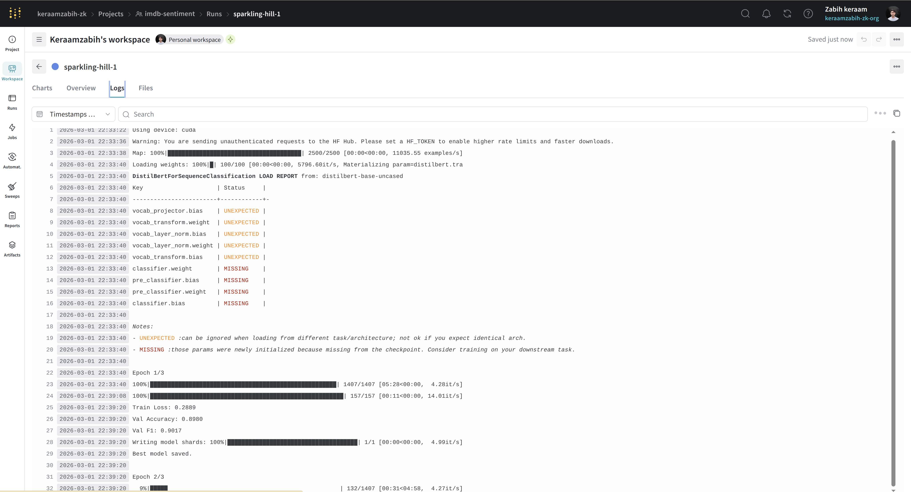
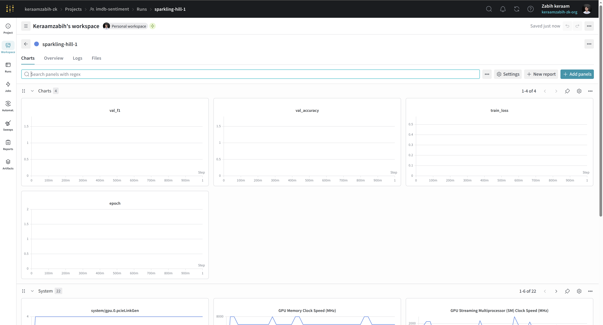
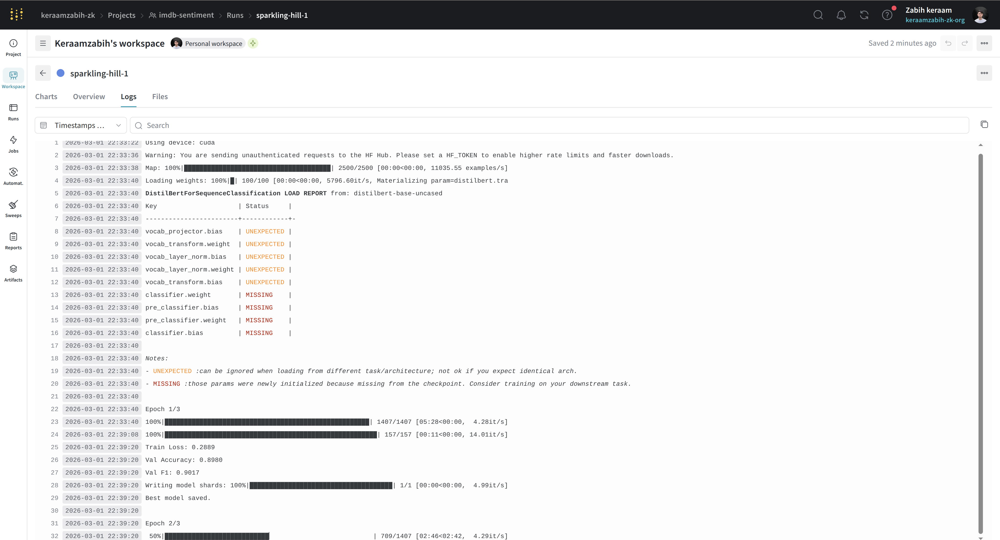
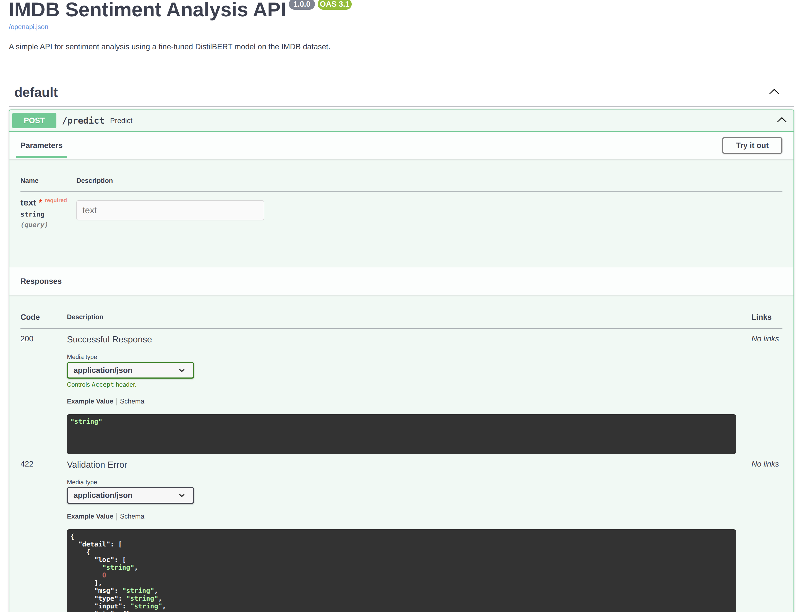

# IMDB Sentiment Analysis with DistilBERT

## 📌 Overview
This project builds a Transformer-based sentiment classifier fine-tuned on the IMDB dataset using DistilBERT.

## 🚀 Features
- Fine-tuned DistilBERT model (`distilbert-base-uncased`)
- ~90%+ validation accuracy
- FastAPI REST API for inference
- TensorBoard + Weights & Biases experiment tracking
- Production-ready project structure

## 📊 Results
| Metric | Score |
|---|---|
| Validation Accuracy | 0.9068 |
| Validation F1 Score | 0.9065 |

## 🧠 Model
- **Pretrained base:** `distilbert-base-uncased`  
  *(FIX: was incorrectly listed as bert-base-uncased in the original README)*
- **Architecture:** DistilBERT + Dropout(0.3) + Linear classifier (2 classes)

## 🛠 Installation

```bash
pip install -r requirements.txt
```

## ⚙️ Usage

### Train
```bash
python src.train.py
```

### Run API
```bash
uvicorn src.app:app --reload
```

### Inference (single text)
```bash
python src.inference.py
```

## 🔐 Secrets & API Keys
Never hardcode API keys in source files. Set your WandB key as an environment variable before training:

```bash
export WANDB_API_KEY=your_key_here
python train.py
```

## 📁 Project Structure
```
├── train.py          # Fine-tuning script
├── model.py          # Custom SentimentModel class
├── evaluate.py       # Evaluation utilities
├── inference.py      # Single-text prediction
├── app.py            # FastAPI REST endpoint
├── checkpoints/      # Saved model weights & tokenizer
└── logs/             # TensorBoard logs
```

## 📸 Screenshots

### 📊 Training Metrics (TensorBoard)

<p align="center">
  
</p>

<p align="center">
  
</p>

<p align="center">
  
</p>

<p align="center">
  
</p>

<p align="center">
  
</p>

<p align="center">
  
</p>

### 🌐 FastAPI Swagger UI

<p align="center">
  
</p>
